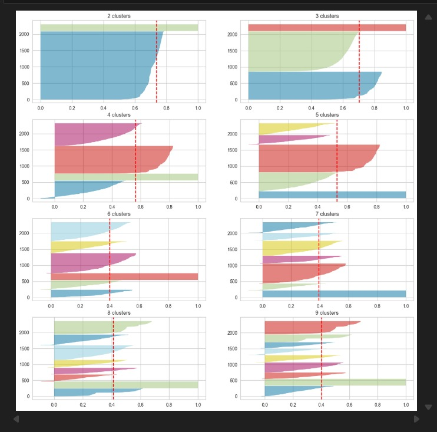

# MachineLearning_DataMining_CustomerBehaviorPrediction  
Este projeto usa técnicas de Machine Learning e Mineração de Dados para interpretar o comportamento de um grande volume de clientes de um serviço. O projeto é focado em aprendizado não supervisionado, empregando as seguintes técnicas:
- K-Means Clusters
- Hierarchical Clusters

O cénario em questão é uma analise dos habitos de gastos e frequencia dos clientes de um casino. Um total de 69734 transações realizadas por 2280 foram analisadas para compreender o perfil dos clientes e prever seus comportamentos e estratégias de negócio que podem ser adotadas direciondas a cada grupo.

## Estrutura  
O conteúdo do projeto está inteiramente num arquivo Jupyter Notebook, isto inclue:
- ETL e limpeza do dataset
- Gráficos e visualizações que representem os agrupamentos formados

  

- Analise e interpretação do desempenho do modelo e dos dados em questão

## Técnologias Utilizadas
- Para fins demonstrativos, o sistema ultilizou uma base de dados padrão fornecida pela [Mendeley Data](https://data.mendeley.com/datasets/9j5gcygnwg/1)
- O sistema depende de um ambiente utilizando **Python 3.11**;
- Técnologias de Machine Learning foram empregadas utilizando a biblioteca **sklearn**.
